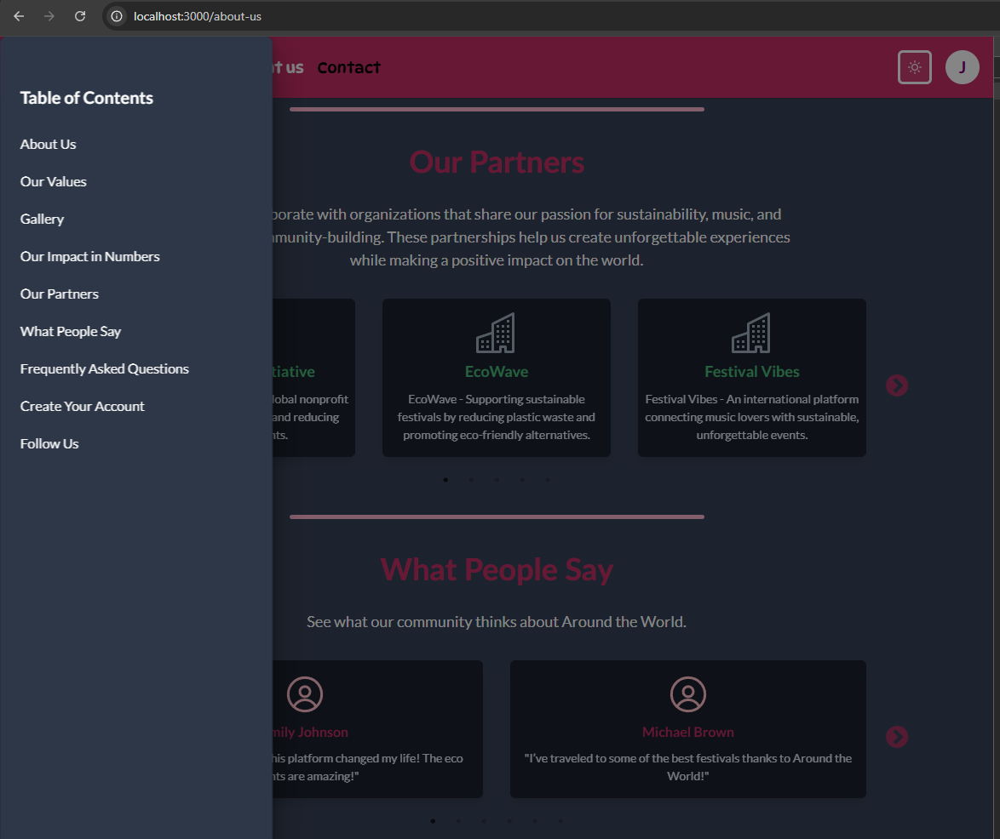

# Around The World - Event Management System PWA

## Live Demo  

### 🔗 **[Check out the deployed version here](https://around-the-world-frontend.vercel.app)**

## About This Project  
This project is a web application built with **Next.js**, utilizing **NextAuth** for authentication, **Apollo Client** to manage GraphQL queries and mutations, and **Strapi** as a headless CMS powered by **PostgreSQL**. The UI is designed with **Chakra UI**, ensuring a responsive and accessible user experience.  

Some pages leverage **Server-Side Rendering (SSR)** for improved performance and SEO. The project follows the **MVVM architecture**, with **MobX** handling state management, ensuring a structured and efficient development workflow.


## Short Note
Due to increased cloning activity, I have decided to secure this project by making the repository private. However, the project will be deployed soon, and you can still access its details here. Below is the original README.md from the previous repository.

## Table of Contents
- [Live Demo](#live-demo)
- [Screenshots & Code Samples](#screenshots--code-samples)
- [Introduction](#introduction)
- [Dependencies](#dependencies)
- [Running the Project Locally](#running-the-project-locally)
- [Running the Project via Docker](#running-the-project-via-docker)
- [Nodemailer Configuration](#nodemailer-configuration)
- [Account Management with Strapi](#account-management-with-strapi)


## Screenshots & Code Samples
Here you can find some screenshots from the project along with key code snippets that showcase its architecture.

### Screenshots


#### Landing page

#### Filtered news - we moved from landing page to eco

#### Contact us page - dark mode

#### Sign in page - dark mode

#### Register page - form handling

#### Register page - form handling

#### Register page - form handling

#### Sign in page - form handling

#### News page, user logged, header

#### Your profil page

#### 404

#### 404 - dark mode

#### Under construction

#### About us page

#### About us page - mobile

#### About us page - tablet, dark mode

#### About us page - faq, dark mode

#### About us page - gallery

#### About us page - gallery

#### About us page - gallery, mobile

#### News page - mobile

#### Single news page

#### reCAPTCHA - mobile

#### Server errors

#### Server errors

#### Server error page


### Code Samples
```
export class AuthorizationModel extends Model {
  username: string = '';
  email: string = '';
  password: string = '';
  passwordConfirmation: string = '';
  newPassword: string = '';

  resetPasswordCode?: string = '';

  login: Command<void, any>;
  register: Command<void, any>;
  sendResetPasswordCode: Command<void, any>;
  resetPassword: Command<void, any>;

  serverErrors: string = '';
  showErrors: boolean = true;

  successfulLogin: boolean = false;
  successfulSendForm: boolean = false;

  constructor({ resetPasswordCode }: { resetPasswordCode?: string } = {}) {
    super();
    this.resetPasswordCode = resetPasswordCode ?? '';
    makeObservable(this, {
      username: observable,
      email: observable,
      password: observable,
      passwordConfirmation: observable,
      newPassword: observable,

      serverErrors: observable,
      showErrors: observable,
```
```
query news($categories: [String], $page: Int!, $pageSize: Int!, $sort: [String]) {
  news(
    filters: { category: { in: $categories } }
    pagination: { page: $page, pageSize: $pageSize }
    sort: $sort
  ) {
    meta {
      pagination {
        ...PaginationMeta
      }
    }
    data {
      id
      attributes {
        title
        content
        category
        picture {
          data {
            attributes {
              url
            }
          }
        }
        ...DateFieldsNews
      }
    }
  }
}

query singleNews($id: ID) {
  new(id: $id) {
    data {
      attributes {
        title
        content
        category
        picture {
          data {
            attributes {
              url
            }
          }
        }
        ...DateFieldsNews
      }
    }
  }
}
```
```
import * as GraphQL from '@/graphql/generates/graphql';
import { client } from '@/apollo/client';
import { DEFAULT_CONTACT_INFO } from '@/constants/contactInfo';

export async function getContactInfo() {
  const { data } = await client.query<GraphQL.ContactInfoQuery>({
    query: GraphQL.ContactInfoDocument,
  });
  if (data.contactInfo?.data) {
    return {
      ...data.contactInfo?.data?.attributes,
      googleMapsImage: data.contactInfo?.data?.attributes?.googleMapsImage?.data?.attributes?.url,
    };
  } else {
    return DEFAULT_CONTACT_INFO;
  }
}

export type GetContactInfoReturnType = Awaited<ReturnType<typeof getContactInfo>>;
```
```
const errorLink = onError(({ graphQLErrors, networkError }) => {
  if (graphQLErrors)
    graphQLErrors.forEach(({ message, locations, path }) =>
      console.log(`[GraphQL error]: Message: ${message}, Location: ${locations}, Path: ${path}`),
    );
  if (networkError) console.error(`[Network error]: ${networkError}`);
});

const httpLink = (headers?: Record<string, string>) => {
  // Check whether the application is running in Docker
  const uri = process.env.BACKEND_INTERNAL_URL
    ? typeof window === 'undefined'
      ? `${process.env.BACKEND_INTERNAL_URL}/graphql`
      : `${process.env.NEXT_PUBLIC_BACKEND_URL}/graphql`
    : `${process.env.NEXT_PUBLIC_BACKEND_URL}/graphql`;

  return new HttpLink({
    uri,
    fetchOptions: { cache: 'no-store' },
    headers: headers,
  });
};

export function makeClient(jwt?: string | undefined) {
  const headers: Record<string, string> = {};
  if (jwt) {
    headers['Authorization'] = 'Bearer ' + jwt;
  }
  return new ApolloClient({
    cache: new InMemoryCache(),
    link: from([errorLink, httpLink(headers)]),
  });
}

export const client = makeClient();

export const useClientWithGetSession = async () => {
  const session = await getCustomSession();
  const client = makeClient(session.jwt);
  return client;
};
```
```
const AboutUsView: React.FC = () => {
  const dividerColor = useColorModeValue('main', 'pink.200');
  const sectionDivider = (
    <Divider
      borderBottomWidth={{ base: '3px', sm: '5px' }}
      borderRadius="full"
      color={dividerColor}
      mx="auto"
      opacity="1"
      size="lg"
      width="50%"
    />
  );
  return (
    <PageWrapper maxWidth="1400px" mb="14" px="4">
      <Flex>
        <TableOfContents />
        <Box flex="1" pl={{ base: 0, md: 20, xl: 6 }} pr={{ base: 0, md: 20, xl: 14 }}>
          <IntroductionSection />
          {sectionDivider}
          <ValuesSection />
          <GallerySection />
          <StatisticsSection />
          {sectionDivider}
          <PartnersSection />
```
```
export function Providers({ children, session }: ProvidersProps) {
  return (
    <SessionProvider session={session}>
      <NavigationProvider>
        <AuthWrapper>
          <CacheProvider>
            <ChakraProvider theme={theme}>
              <ColorModeScript initialColorMode={theme.config.initialColorMode} />
              {children}
            </ChakraProvider>
          </CacheProvider>
        </AuthWrapper>
      </NavigationProvider>
    </SessionProvider>
```
```
const RegisterView: NextPage<RegisterViewType> = observer(({ model }: RegisterViewType) => {
  return (
    <PageWrapper isForm>
      <Heading as="h1" color="purple" fontSize="3xl" mb="6" textAlign="center">
        Create an account
      </Heading>
      <VStack gap="4" mb="6">
        <CustomFormControl
          errorMessage="Enter your username"
          isInvalid={model.showErrors && !model.isUsername}
          labelTitle="Username"
        >
          <CustomInput {...bindProperty(model, 'username')} placeholder="Username" />
        </CustomFormControl>
        <CustomFormControl
          errorMessage="Invalid email address"
          isInvalid={model.showErrors && !model.isEmailCorrect}
          labelTitle="E-mail"
        >
          <CustomInput {...bindProperty(model, 'email')} placeholder="Email address" />
        </CustomFormControl>
        <CustomFormControl
          errorMessage="Your password should be really secure! It must contain at least 6 characters, including at least one uppercase letter, one lowercase letter and one number."
          isInvalid={model.showErrors && !model.isPasswordCorrect}
          labelTitle="Password"
        >
          <CustomPasswordInput {...bindProperty(model, 'password')} placeholder="Password" />
        </CustomFormControl>
```
---

The rest of the README.md remains unchanged from the previous repository.

## Introduction
This is a monorepo project combining a frontend (Next.js + Chakra UI/Tailwind CSS) and a backend (Strapi).

### Chakra UI vs Tailwind CSS
Due to the fact that I wanted to focus more on logic in the project, I decided to use Chakra UI, but I left Tailwind because I would like to use it even to write maybe a few views.

## Dependencies
To maintain a single `package-lock.json` file and avoid potential conflicts, install all dependencies from the main project directory:
```
  npm install
  npm install <package-name> --workspace=backend
```
  etc.

## Running the Project Locally
- Set Up Environment Variables on the backend and frontend based on the provided .env.example, env.docker.example, etc.
- From the main project directory, install all dependencies for both workspaces
```
npm run install-all
```
- Additionally, you will need PostgreSQL and create a database ("backend/.env.example") and then import the data.
```
psql -U postgres -d around_the_world -f backend/db/db_backup.sql
```
- Build backend
```
npm run build --workspace=backend
```
- Run the GraphQL Code Generator (when backend is running)
```
npm run gen
```
- Kill the process and run the app again (and and for each subsequent run only)
```
npm run start
```
## Running the Project via Docker
- Set Up Environment Variables on the backend and frontend based on the provided .env.example, env.docker.example, etc.
- From main folder
```
docker-compose up --build
```
- Run the GraphQL Code Generator
```
npm run gen
```
- Kill process and restart (and and for each subsequent run only)
```
docker-compose up
```
- For stops and removes containers, volumes
```
docker-compose down -v
```

## Nodemailer Configuration
backend/.env.example
- To be able to confirm user accounts via e-mail, you need Nodemailer provider for Strapi, 
If you want to use gmail account for this purpose, create a google app password:
[How to create app password in google](https://knowledge.workspace.google.com/kb/how-to-create-app-passwords-000009237)

## Account Management with Strapi
**Account Confirmation/Restart Password View url**
- Strapi/Settings/Advanced settings/Redirection url - http://localhost:3000/account-confirmation (Your localhost address)
- Strapi/Settings/Advanced settings/Reset password page - http://localhost:3000/reset-password (Your localhost address)
- Changing login details to the admin panel in Strapi
```
npm run strapi admin:reset-user-password --email="your_email" --password="your_password"
```
- Default is
```
"Admin@gmail.com" "tHt1passPH#" 
```